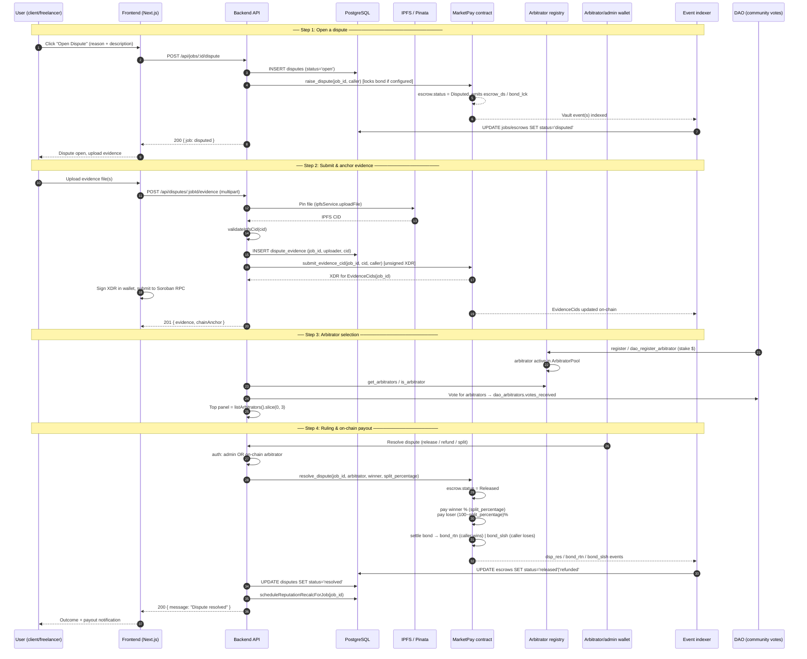

# Dispute Resolution

This document explains Stellar MarketPay's 3-step arbitration process: how a
dispute is opened, how evidence is submitted, how arbitrators are selected, and
how the resolution is enforced on-chain.

It has two audiences:

- **[User-facing guide](#user-facing-guide)** — step-by-step instructions for
  clients and freelancers: opening a dispute, uploading evidence, and awaiting
  resolution.
- **[Developer guide](#developer-guide)** — the arbitration flow end-to-end
  (backend → contract → payout), including sequence diagrams, data model,
  endpoints, and contract functions.

---

## Overview: the 3-step arbitration process

Every dispute follows the same shape:

1. **Open a dispute** — either participant freezes the escrow by raising a
   dispute on the job (on-chain `raise_dispute`). The escrow enters the
   `Disputed` state and no further release or refund is possible.
2. **Submit evidence** — both parties upload files (screenshots, deliverables,
   documents). Files are pinned to IPFS and their CIDs are anchored on-chain as
   an append-only audit trail, so evidence cannot be silently modified or lost.
3. **Resolve & enforce** — arbitrators (selected from the DAO-governed
   arbitrator registry) rule on the case. The ruling is enforced on-chain by
   `resolve_dispute`, which pays out the escrow split between the parties and
   settles the dispute bond, then the backend syncs the new state and recalculates
   reputation.

```
open dispute ──▶ submit evidence ──▶ arbitrator ruling ──▶ on-chain payout
(raise_dispute)  (IPFS + CID anchor)  (regsitry panel)     (resolve_dispute)
```

---

## User-facing guide

### Before you open a dispute

- Disputes are only available to the **client** and the **freelancer** on the job
  (one dispute per job — a second attempt is rejected).
- Only jobs whose escrow is **not** already `Released`, `Refunded`, `Frozen`, or
  `Disputed` can be disputed.
- If the admin has configured a **dispute bond**, the party opening the dispute
  must lock the bond amount in escrow. The bond is returned if that party wins
  the dispute, or slashed to the winner if that party loses. This deters
  frivolous filings.
- Both parties are **notified** and the job/escrow turns `disputed`. All pending
  work is paused until resolution.

### Step 1 — Open a dispute

1. Go to the job page and click **Open Dispute**.
2. Select a **reason** (e.g. *Work not completed*, *Work doesn't match
   description*, *Communication issues*, *Other*).
3. Enter a **description** with the details of the disagreement and submit.
4. If required, approve the dispute-bond transaction in your wallet.

The job is now frozen in the `disputed` state and the other party is notified.

> Milestone-based jobs can also dispute a single milestone via
> **Dispute Milestone**; the milestone (rather than the whole escrow) is flagged
> as `disputed`.

### Step 2 — Upload evidence

Once the dispute is open, either party can upload evidence:

1. From the dispute view, click **Upload evidence**.
2. Attach files — screenshots of messages, work samples, deliverables, timelines,
   documentation, or any relevant files.
3. Submit. The file is pinned to IPFS and its content ID (CID) is anchored
   on-chain for the job.

**Evidence rules**

| Rule | Limit |
|---|---|
| Files per party | 5 |
| Max file size | 10 MB |
| Allowed types | JPEG, PNG, GIF, MP4, PDF |
| Access | Signed proxy URL, valid 15 minutes |
| Chain anchoring | Each CID is written to the contract's `EvidenceCids` audit trail |

Tips:

- Upload good evidence on the first attempt — you cannot add evidence **after**
  the dispute is resolved.
- Keep originals; the platform stores files on IPFS (via Pinata) and can always
  retrieve them by CID.
- You can view the on-chain-attested CIDs on the dispute page
  (`GET /api/disputes/:jobId/onchain-cids`).

### Step 3 — Await resolution & payout

1. Arbitrators review the evidence and the parties' submissions.
2. A decision is reached (see [how arbitrators are selected](#arbitrator-selection)
   and [how rulings are enforced on-chain](#on-chain-enforcement)).
3. The escrow is paid out according to the ruling and the dispute is marked
   `resolved`. Both parties are notified of the outcome.

**Expected timeline** ([FAQ](FAQ.md#disputes--refunds))

| Stage | Duration |
|---|---|
| Initial review | 24–48 hours |
| Investigation | 3–7 days |
| Final decision | Within 7 days |
| Appeal | 7 days after the decision |

**Possible outcomes**

- **Funds released to the freelancer** — the dispute is decided in the
  freelancer's favor.
- **Funds refunded to the client** — the dispute is decided in the client's
  favor.
- **Split** — the ruling can split the escrow between the parties (e.g. 60/40),
  expressed as a percentage to the winner.

Dispute outcomes also feed both parties' reputation scores — losing disputes (and
a higher dispute rate) lower reliability scores and can affect account standing.

---

## Developer guide

### Components

| Component | Location | Role |
|---|---|---|
| REST endpoints (dispute/evidence) | `backend/src/routes/disputes.js` | Evidence upload, retrieval, signed URLs, on-chain CID reads |
| REST endpoints (job dispute) | `backend/src/routes/jobs.js` | `POST /api/jobs/:id/dispute` and `POST /api/jobs/:id/resolve` |
| REST endpoints (admin) | `backend/src/routes/admin.js` | List and resolve disputes (`requireAdminRole` + 2FA) |
| Dispute service | `backend/src/services/disputeService.js` | Create/resolve disputes, validate CIDs, feed reputation |
| on-chain evidence anchor | `backend/src/services/sorobanEvidence.js` | Build `submit_evidence_cid` XDR, read `get_evidence_cids` |
| Arbitrator registry client | `backend/src/services/sorobanArbitratorRegistry.js` | Read on-chain arbitrators, merge DB metadata |
| DAO service | `backend/src/services/daoService.js` | Off-chain arbitrator registry, voting, top panel |
| IPFS / Pinata | `backend/src/services/ipfsService.js` | Pin evidence files, gateways, signed URL tokens |
| MarketPay contract | `contracts/marketpay-contract/src/disputes.rs` | `raise_dispute`, `resolve_dispute`, bond handling |
| Arbitrator-registry contract | `contracts/arbitrator-registry/src/lib.rs` | Staked registration, DAO add/remove, reads |
| Event indexer | `backend/src/services/indexerService.js` | Mirrors on-chain events into PostgreSQL |

### Sequence diagram — arbitration flow (backend → contract → payout)



### How a dispute is opened (backend)

- `POST /api/jobs/:id/dispute` (`jobs.js:762`) — `{ reason, description }`,
  authenticated. Calls `raiseDispute`, which inserts a `disputes` row with
  `status = 'open'` and — via the contract `raise_dispute` — moves the escrow to
  `Disputed`. Admin may configure a per-job lockable **dispute bond**
  (`set_dispute_bond`); the bond snapshot is stored under
  `DataKey::DisputeBond(job_id)`.
- `POST /api/escrow/:jobId/dispute-milestone` (`escrow.js:316`) — flags a single
  milestone `disputed` (used by milestone-based escrows).
- Guards: only the job's client/freelancer may raise (`7001`); the escrow must
  not be `Released`/`Refunded`/`Frozen`/`Disputed` (`7002`); one dispute per job.

### How evidence is submitted

- `POST /api/disputes/:jobId/evidence` (`disputes.js:174`) — multipart upload,
  JWT required, only the client/freelancer may upload. Enforces 5 files/party,
  10 MB, and the MIME allow-list.
- The file is pinned to IPFS via `ipfsService.uploadFile`; the CID is validated
  against the CID regex, persisted to `dispute_evidence`, and then anchored
  on-chain: `sorobanEvidence.recordEvidenceCidOnChain` returns an unsigned
  `submit_evidence_cid(job_id, cid, caller)` XDR that the frontend signs and
  submits to Soroban RPC. Anchoring is **best-effort** — if the contract is not
  deployed, linkage still works off-chain.
- `GET /api/disputes/:jobId/onchain-cids` (`disputes.js:60`) reads the chain
  audit trail (`get_evidence_cids`), cached for 30 s.
- `GET /api/disputes/:jobId/evidence/:id/url` returns a **15-minute signed proxy
  URL**; the `/proxy` path verifies the token and that the CID matches the stored
  record before streaming the file from IPFS through the backend. Evidence access
  is audit-logged (`audit_log.action = 'evidence_access'`).

### Arbitrator selection

- **Registry**: arbitrators register on the `arbitrator-registry` contract by
  staking the configured minimum (`ArbitratorMinStake`); registration, removal,
  and DAO add/remove are governed by the community (`arbitrator_registry` types).
  `dao_register_arbitrator` / `dao_remove_arbitrator` exist so a passed DAO
  `arbitration` proposal can be executed on-chain (`daoService.executeProposal`).
- **Off-chain standing**: `dao_arbitrators` stores display name, bio,
  `votes_received`, and `disputes_resolved`. Users vote for candidates via
  `POST /api/dao/arbitrators/:publicKey/vote`.
- **Top panel**: `daoService.getTopArbitratorPanel(limit = 3)` returns the
  top-3 arbitrators by score from `listArbitrators()` — the dispute panel
  surfaced to users (`GET /api/dao/arbitrators`).
- **On-chain enforcement identity**: the MarketPay contract resolves disputes
  through a single designated address set by admin via `set_arbitrator`
  (`DataKey::ArbitratorAddress`). `disputeService.resolveDispute` authorizes a
  resolver that is either an admin profile **or** an active on-chain arbitrator
  (`sorobanArbitratorRegistry.isArbitrator`).

> **Implementation status**: the single-arbitrator `resolve_dispute` path and
> evidence anchoring are fully wired. A multi-arbitrator **2-of-3 median-vote**
> panel is specified (see `resolve_arbitration` in `certificates.rs`, which
> resolves an `ArbitrationCase` by the median of exactly 3 stored votes), but the
> contract currently lacks public entrypoints to open a case or cast the 3 votes,
> so that panel voting path is **not yet wired end-to-end** on-chain.

### On-chain enforcement (contract → payout)

`resolve_dispute` (`contracts/marketpay-contract/src/disputes.rs:124`):

1. Auth: only the designated arbitrator (matches `DataKey::ArbitratorAddress`)
   may call (`7003`); escrow must be `Disputed` (`7004`).
2. `split_percentage` (0–100) of the escrow amount goes to `winner`
   (must be client or freelancer); the remainder goes to the other party.
3. Escrow moves to `Released`; timeout/deliverable keys are cleaned up.
4. **Bond settlement**: if a `DisputeBond` was locked — the bond-caller wins →
   bond returned (`bond_rtn`); bond-caller loses → bond slashed to the winner
   (`bond_slsh`). The bond record is consumed so a second call cannot re-settle.
5. Emits `dsp_res` (arbitrator, winner, loser, amounts) so the indexer can sync.

State effects:

| Layer | Before | After |
|---|---|---|
| Contract | `escrow.status = Disputed` | `Released`; split paid; bond settled |
| DB escrow (`indexerService`) | `disputed` | `released` / `refunded` |
| DB disputes | `open` | `resolved` (+ `resolved_by`, `resolution`, `resolved_at`) |
| Jobs | `disputed` | `completed` (freelancer wins) / `cancelled` (client wins) |
| Reputation | — | `scheduleReputationRecalcForJob(jobId)` |

Admin can also resolve through the UI:
`PATCH /api/admin/disputes/:jobId/resolve` (`admin.js:510`) — admin role + 2FA,
marks the escrow `resolved`, sets the job `completed`/`cancelled` based on
`releaseTo`, and writes `admin_audit_log` + contract-interaction audit entries.
`POST /api/jobs/:id/resolve` is the older single-admin endpoint gated by
`ADMIN_PUBLIC_KEY`.

### Data model

| Table | Purpose |
|---|---|
| `disputes` | One row per job dispute (`job_id`, `raised_by`, `reason`, `description`, `status`, `resolved_by`, `resolution`, timestamps) |
| `dispute_evidence` | Per-file evidence (`job_id`, `uploader_address`, `file_name`, `size`, `mime_type`, `ipfs_cid`) |
| `dao_arbitrators` | Off-chain arbitrator profiles and accrued votes |
| `escrows` | Mirrored escrow state incl. `disputed` / `resolved` |

### Related endpoints

| Method | Endpoint | Purpose |
|---|---|---|
| POST | `/api/jobs/:id/dispute` | Open a dispute (reason + description) |
| POST | `/api/escrow/:jobId/dispute-milestone` | Dispute a single milestone |
| GET | `/api/disputes/:jobId` | Dispute details + evidence list |
| POST | `/api/disputes/:jobId/evidence` | Upload evidence file |
| GET | `/api/disputes/:jobId/evidence/:id/url` | Signed (15 min) proxy URL |
| GET | `/api/disputes/:jobId/onchain-cids` | Chain-attested evidence CIDs |
| GET | `/api/dao/arbitrators` | Arbitrator list + top panel |
| POST | `/api/dao/arbitrators/:publicKey/vote` | Vote for an arbitrator |
| GET | `/api/admin/disputes` | List open disputes (admin) |
| PATCH | `/api/admin/disputes/:jobId/resolve` | Resolve a dispute (admin) |

### Key contract functions

| Function | File | Description |
|---|---|---|
| `raise_dispute` | `disputes.rs:19` | Freeze escrow as `Disputed`; lock bond if configured |
| `resolve_dispute` | `disputes.rs:124` | Arbitrator-only split payout + bond settlement |
| `set_dispute_bond` / `get_dispute_bond_config` / `get_dispute_bond` | `disputes.rs:252` | Admin bond config and per-job snapshots |
| `set_arbitrator` / `get_arbitrator` | `admin.rs:172` | Designate the on-chain dispute resolver |
| `submit_evidence_cid` / `get_evidence_cids` | `certificates.rs` / `sorobanEvidence.js` | Anchored evidence audit trail |
| `resolve_arbitration` | `certificates.rs:201` | Median-of-3 panel vote resolution (spec) |
| `register` / `deregister` / `dao_register_arbitrator` | `arbitrator-registry/src/lib.rs` | Staked arbitrator lifecycle |

---

## Related documentation

- [FAQ: Disputes & Refunds](FAQ.md#disputes--refunds)
- [IPFS / Pinata evidence storage](ipfs-setup.md)
- [Contract API reference — Disputes & arbitration](contract-api-reference.md)
- [Contract errors — 7xxx dispute codes](contract-errors.md)
- [Escrow lifecycle / architecture](architecture.md)
- [Environment variables: `DISPUTE_CONTRACT_ID`, `ARBITRATOR_REGISTRY_CONTRACT_ID`](environment-variables.md)